# Work Session Report: January 31 – February 1, 2026

## Summary

A two-day work session produced 137 commits across 5 repositories, resulting in 9 software releases and over 22,000 lines of code. The work involved bootstrapping four new projects from scratch: a Whisper-based speech-to-text server, three MCP (Model Context Protocol) servers for Claude Code tooling, and a voice-controlled Telegram bot that ties them together.

## Quantitative Overview

### January 31, 2026

| Repository | Commits | Releases | Lines Added | Lines Removed |
|------------|---------|----------|-------------|---------------|
| whisper-server | 42 | 2 (v0.1.0, v0.1.1) | 3,895 | 292 |
| mcp-merge-guard | 17 | 0 | 6,115 | 144 |
| mcp-worktree-guard | 11 | 1 (v0.2.0) | 3,285 | 143 |
| mcp-memory-server | 9 | 0 | 1,623 | 11 |
| **Subtotal** | **79** | **3** | **14,918** | **590** |

### February 1, 2026

| Repository | Commits | Releases | Lines Added | Lines Removed |
|------------|---------|----------|-------------|---------------|
| voice-agent | 34 | 1 (v0.1.0) | 6,588 | 364 |
| mcp-merge-guard | 19 | 3 (v0.2.0, v0.3.0, v0.4.0) | 218 | 194 |
| mcp-worktree-guard | 5 | 1 (v0.3.0) | 121 | 94 |
| mcp-memory-server | 3 | 1 (v0.2.0) | 116 | 0 |
| whisper-server | 2 | 0 | 224 | 4 |
| **Subtotal** | **63** | **6** | **7,267** | **656** |

### Combined Totals

| Metric | Value |
|--------|-------|
| Total commits | 137 |
| Total releases | 9 |
| Lines added | 22,185 |
| Lines removed | 1,246 |
| Net lines | 20,939 |
| Repositories touched | 5 |
| New projects created | 4 |

## Commit Type Distribution

### Two-Day Combined

### By Day

=== "January 31"

    | Type | Count | Percentage |
    |------|-------|------------|
    | fix | 30 | 41% |
    | docs | 17 | 23% |
    | feat | 16 | 22% |
    | chore | 6 | 8% |
    | ci | 2 | 3% |
    | refactor | 2 | 3% |
    | style | 1 | 1% |

=== "February 1"

    | Type | Count | Percentage |
    |------|-------|------------|
    | feat | 22 | 41% |
    | fix | 19 | 35% |
    | ci | 4 | 7% |
    | chore | 4 | 7% |
    | docs | 3 | 6% |
    | style | 1 | 2% |
    | refactor | 1 | 2% |

## Timeline

### Day 1: January 31 (Infrastructure Day)

### Day 2: February 1 (Integration Day)

## Architecture Overview

```mermaid
flowchart TD
    User["👤 User (Voice)"]
    Telegram["📱 Telegram"]
    Whisper["🎤 whisper-server<br/><small>faster-whisper + LLM grammar</small>"]
    VoiceAgent["🤖 voice-agent<br/><small>Permission UI + Session mgmt</small>"]
    Claude["⚡ Claude CLI<br/><small>Agent SDK</small>"]
    MergeGuard["mcp-merge-guard<br/><small>PR status, CI checks</small>"]
    WorktreeGuard["mcp-worktree-guard<br/><small>Worktree listing</small>"]
    MemoryServer["mcp-memory-server<br/><small>RAM/swap, Processes</small>"]
    OtherTools["Other Tools<br/><small>Bash, Read, etc.</small>"]

    User --> Telegram
    Telegram --> Whisper
    Telegram --> VoiceAgent
    Whisper -->|text| VoiceAgent
    VoiceAgent --> Claude
    Claude --> MergeGuard
    Claude --> WorktreeGuard
    Claude --> MemoryServer
    Claude --> OtherTools
```

## Project Descriptions

### whisper-server
WebSocket server for real-time speech-to-text. Uses faster-whisper for transcription with optional LLM post-processing for grammar correction. Deployable via Docker or NixOS module. Compatible with Konele Android app.

### mcp-memory-server
MCP server that exposes system memory information to Claude. Reports RAM/swap usage, lists processes by memory consumption, and provides warnings when resources are low.

### mcp-merge-guard
MCP server for GitHub PR management. Checks PR status, CI results, review state, and merge readiness. Prevents merging PRs that haven't passed checks.

### mcp-worktree-guard
MCP server for git worktree management. Lists worktrees, helps Claude understand which worktree it's operating in, and prevents accidental operations across worktrees.

### voice-agent
Telegram bot that bridges voice input to Claude Code. Transcribes voice messages via whisper-server, sends prompts to Claude Agent SDK, and manages permission approvals through inline keyboards.

## Observations

The 49 bug fixes (36% of commits) reflect the iterative nature of CI/CD configuration. Release automation, test packaging, and Docker builds required repeated adjustments. This trial-and-error is typical when establishing infrastructure from scratch.

The two days show a clear progression: Day 1 focused on building individual components (whisper-server, MCP servers), while Day 2 integrated them through voice-agent and refined release automation across all repositories.

Four projects went from zero to released in 48 hours. The commit history shows small, incremental changes with immediate testing rather than large monolithic commits.

## Technical Stack

- **Languages**: Python (whisper-server, mcp-memory-server, voice-agent), TypeScript (mcp-merge-guard, mcp-worktree-guard), Nix
- **ML/Audio**: faster-whisper, llama-cpp-python
- **Infrastructure**: Nix Flakes, Docker, GitHub Actions
- **Protocols**: WebSocket (whisper), MCP (Claude tools), Telegram Bot API
- **Release Management**: release-please, conventional commits

---

*Generated from git logs and GitHub API data.*
