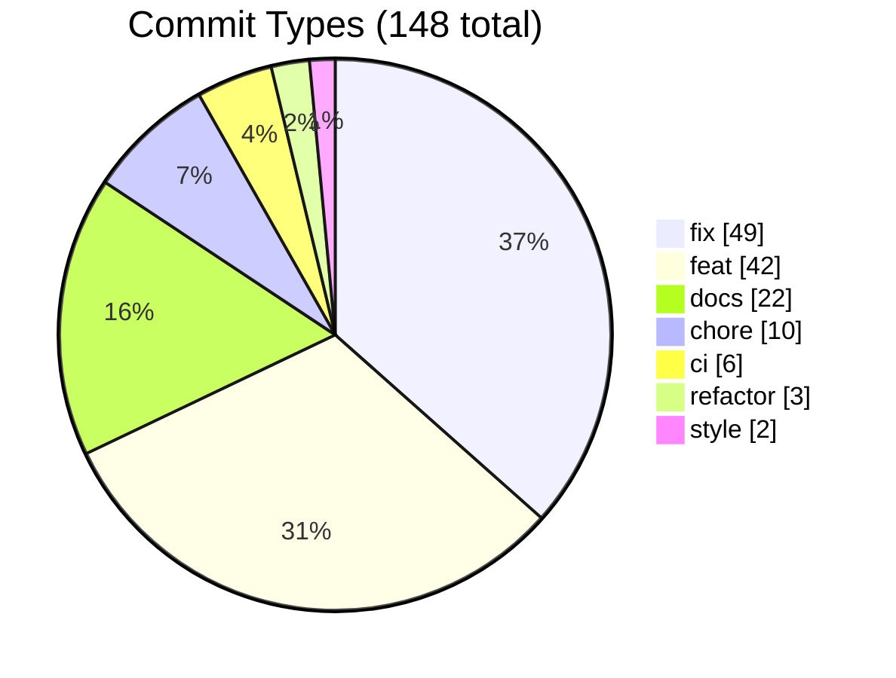

# Work Session Report: January 31 – February 2, 2026

<figure style="text-align: center; margin: 1.5em 0;">
  
</figure>

Two days ago, during my morning walk, I had an idea: what if I could talk to Claude Code through Telegram while walking the dog? Forty-eight hours later, that idea became five working projects, nine releases, and this blog.

## Summary

Over 48 hours (including sleep and meals), 148 commits across 6 repositories resulted in 9 software releases and over 23,000 lines of code. The work involved bootstrapping five new projects from scratch: a Whisper-based speech-to-text server, three MCP (Model Context Protocol) servers for Claude Code tooling, a voice-controlled Telegram bot, and this blog itself.

## Quantitative Overview

### January 31, 2026

| Repository | Commits | Releases | Lines Added | Lines Removed |
|------------|---------|----------|-------------|---------------|
| whisper-server | 42 | 2 (v0.1.0, v0.1.1) | 3,895 | 292 |
| mcp-merge-guard | 17 | 0 | 6,115 | 144 |
| mcp-worktree-guard | 11 | 1 (v0.2.0) | 3,285 | 143 |
| mcp-memory-server | 9 | 0 | 1,623 | 11 |
| **Subtotal** | **79** | **3** | **14,918** | **590** |

### February 1, 2026

| Repository | Commits | Releases | Lines Added | Lines Removed |
|------------|---------|----------|-------------|---------------|
| voice-agent | 34 | 1 (v0.1.0) | 6,588 | 364 |
| mcp-merge-guard | 19 | 3 (v0.2.0, v0.3.0, v0.4.0) | 218 | 194 |
| mcp-worktree-guard | 5 | 1 (v0.3.0) | 121 | 94 |
| mcp-memory-server | 3 | 1 (v0.2.0) | 116 | 0 |
| whisper-server | 2 | 0 | 224 | 4 |
| **Subtotal** | **63** | **6** | **7,267** | **656** |

### February 2, 2026

| Repository | Commits | Releases | Lines Added | Lines Removed |
|------------|---------|----------|-------------|---------------|
| ai-chronicles | 6 | 0 | 1,048 | 443 |
| **Subtotal** | **6** | **0** | **1,048** | **443** |

### Combined Totals

| Metric | Value |
|--------|-------|
| Total commits | 148 |
| Total releases | 9 |
| Lines added | 23,233 |
| Lines removed | 1,689 |
| Net lines | 21,544 |
| Repositories touched | 6 |
| New projects created | 5 |

## Commit Type Distribution

### Three-Day Combined

### By Day

=== "January 31"

    | Type | Count | Percentage |
    |------|-------|------------|
    | fix | 30 | 41% |
    | docs | 17 | 23% |
    | feat | 16 | 22% |
    | chore | 6 | 8% |
    | ci | 2 | 3% |
    | refactor | 2 | 3% |
    | style | 1 | 1% |

=== "February 1"

    | Type | Count | Percentage |
    |------|-------|------------|
    | feat | 22 | 41% |
    | fix | 19 | 35% |
    | ci | 4 | 7% |
    | chore | 4 | 7% |
    | docs | 3 | 6% |
    | style | 1 | 2% |
    | refactor | 1 | 2% |

=== "February 2"

    | Type | Count | Percentage |
    |------|-------|------------|
    | feat | 4 | 67% |
    | docs | 2 | 33% |

## Timeline

### Day 1: January 31 (Infrastructure Day)

### Day 2: February 1 (Integration Day)

### Day 3: February 2 (Documentation Day)

```mermaid
gantt
    title February 2, 2026
    dateFormat HH:mm
    axisFormat %H:%M

    section ai-chronicles
    Create repository           :06:50, 10m
    Expand report to 2 days     :06:56, 5m
    Add MkDocs + GitHub Pages   :07:00, 5m
    Convert to Mermaid diagrams :07:04, 8m
    Final touches               :07:12, 10m
```

## Architecture Overview

The whisper-server serves two parallel use cases:

```mermaid
flowchart TD
    subgraph android["📱 Android"]
        Konele["Kõnele<br/><small>System-wide STT</small>"]
        Telegram["Telegram"]
        AnyApp["Any App"]
    end

    subgraph home["🏠 Home Server"]
        subgraph whisper["whisper-server"]
            WS["WebSocket<br/><small>:2700</small>"]
            HTTP["HTTP<br/><small>:2701</small>"]
        end
        VoiceAgent["🤖 voice-agent<br/><small>Permission UI + Session mgmt</small>"]
        Claude["⚡ Claude CLI<br/><small>Agent SDK</small>"]
        MergeGuard["mcp-merge-guard"]
        WorktreeGuard["mcp-worktree-guard"]
        MemoryServer["mcp-memory-server"]
    end

    Tailscale["🔒 Tailscale VPN"]

    Konele -->|WebSocket| Tailscale
    Tailscale --> WS
    WS -->|text| AnyApp

    Telegram -->|voice file| VoiceAgent
    VoiceAgent -->|audio| HTTP
    HTTP -->|text| VoiceAgent
    VoiceAgent --> Claude
    Claude --> MergeGuard
    Claude --> WorktreeGuard
    Claude --> MemoryServer
```

**Two independent flows:**

1. **Telegram → Claude Code**: Telegram sends voice messages as audio files to voice-agent, which uses whisper-server's HTTP endpoint for transcription, then forwards the text to Claude Agent SDK.

2. **Kõnele → System STT**: The [Kõnele](https://github.com/Kaljurand/K6nele) Android app connects via Tailscale VPN to whisper-server's WebSocket endpoint, providing speech-to-text input for any Android app (notes, messages, search, etc.).

## Project Descriptions

### whisper-server
Speech-to-text server exposing two interfaces: WebSocket for real-time streaming (used by Kõnele) and HTTP for batch transcription (used by voice-agent). Uses faster-whisper for transcription with optional LLM post-processing for grammar correction. Deployable via Docker or NixOS module. Accessible remotely via Tailscale VPN.

### mcp-memory-server
MCP server that exposes system memory information to Claude. Reports RAM/swap usage, lists processes by memory consumption, and provides warnings when resources are low.

### mcp-merge-guard
MCP server for GitHub PR management. Checks PR status, CI results, review state, and merge readiness. Prevents merging PRs that haven't passed checks.

### mcp-worktree-guard
MCP server for git worktree management. Lists worktrees, helps Claude understand which worktree it's operating in, and prevents accidental operations across worktrees.

### voice-agent
Telegram bot that bridges voice input to Claude Code. Transcribes voice messages via whisper-server, sends prompts to Claude Agent SDK, and manages permission approvals through inline keyboards.

### ai-chronicles
This blog. A MkDocs-based static site for documenting AI-assisted development sessions. Built with Nix Flakes, deployed to GitHub Pages, featuring Mermaid diagrams. Created in ~20 minutes via voice commands.

## Observations

The 49 bug fixes (36% of commits) reflect the iterative nature of CI/CD configuration. Release automation, test packaging, and Docker builds required repeated adjustments. This trial-and-error is typical when establishing infrastructure from scratch.

The timeline shows a clear progression: Day 1 focused on building individual components (whisper-server, MCP servers), Day 2 integrated them through voice-agent and refined release automation, and Day 3 documented the work in this self-referential blog.

Five projects went from zero to released in under 48 hours (including sleep and meals). The commit history shows small, incremental changes with immediate testing rather than large monolithic commits.

## Technical Stack

- **Languages**: Python (whisper-server, mcp-memory-server, voice-agent), TypeScript (mcp-merge-guard, mcp-worktree-guard), Nix
- **ML/Audio**: faster-whisper, llama-cpp-python
- **Infrastructure**: Nix Flakes, Docker, GitHub Actions
- **Protocols**: WebSocket (whisper), HTTP (whisper), MCP (Claude tools), Telegram Bot API
- **Networking**: Tailscale VPN (remote access to whisper-server)
- **Release Management**: release-please, conventional commits

---

*Generated from git logs and GitHub API data.*

*This report and the [ai-chronicles](https://github.com/paolino/ai-chronicles) repository itself were created entirely through voice interaction with Telegram, using the voice-agent system described above. Total time from first prompt to published site with Mermaid diagrams: ~20 minutes.*
